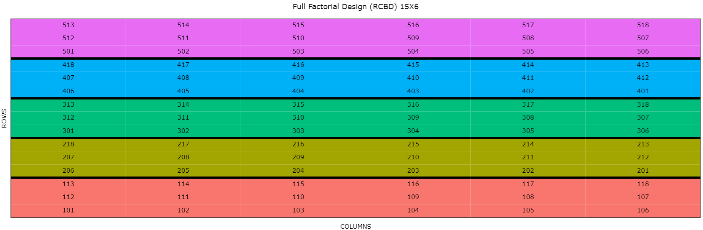

__1.	The following data set has 2 mistakes. Find the issue and analyze the experiment.__  
__Include all the necessary analysis and interpretation__

The two problems is that there are shift in plot number and the cultivar 
between block 2 and 5 is misplaced between them.
```{r}
library(desplot)
df <- read.csv("HW5_Q1_fixed.csv")
df<- transform(df, 
               row= as.factor(row),
               column=as.factor(column),
               fer= as.factor(fer),
               block= as.factor(block),
               cultivar= as.factor(cultivar))
desplot(df, block ~ column+row, col= fer, text= cultivar, cex=0.5,out1= block,
        gg= F, ticks= T)

# fixing the error 
df.fixed<- df
df.fixed[(df.fixed$row == 5) & (df.fixed$column %in% 21:25), 'block'] <- 3
df.fixed[(df.fixed$row == 8) &(df.fixed$column %in% 1:5),'block']<- 3
df.fixed[(df.fixed$row==10) & (df.fixed$column%in%20:24), 'block'] <- 5
df.fixed[(df.fixed$row== 3) & (df.fixed$column %in% 10), "plot"] <- 60
df.fixed[(df.fixed$row== 7) & (df.fixed$column %in% 10), "plot"] <- 160

desplot(df.fixed, block ~ column+row, col= fer, text= cultivar, cex=0.5,out1= block,
        gg= F, ticks= T)
library(ExpDes)
```

running anova for further analysis:

In the anova we can see that block effect is significant meaning that it is 
helping in accounting for the variation among the group of exp units.The interaction between the cultivar and fertilizer is significant meaning that we have to account for an interaction between fertilizer and cultivar while estimating the yield and we can not account factor effect independently also. Also, each factor has significant effect on yield too.
```{r}
mod1<- aov(y ~ block + cultivar * fer, data= df.fixed)
summary(mod1)

#diagnostic plot
plot(mod1)
```
 from diagnostic plot we can be clear that the assumption of anova is violated and the residual are not normal independent and homogenous.Lets run test for these assumption to be sure:

```{r}
#assumption check


#homogenety test
car:: leveneTest(y~ cultivar* fer, data= df.fixed)

#shapiro wilk test
shapiro.test(mod1$residuals)

```
From shapiro and levene test we can say that the assumptions of anova are not met and the experiment residuals are not homogenous and normally distributed.


From test and diagnostic plot we can see that the assumptions of anova is violated.so we are transforming the data with box-cox power transformation
```{r}
bc<- MASS:: boxcox(mod1)
lambda<- bc$x[which.max(bc$y)]
lambda

#rerunning model
ty<- transform(df.fixed, ty= y^lambda)
mod1trans<- aov(ty~ block + cultivar* fer, data= ty)

summary(mod1trans)
plot(mod1trans)

#homogeneity test
car::leveneTest(ty ~cultivar* fer, data= ty)

#shapiro test
shapiro.test(mod1trans$residuals)

```
 thus, shapiro test and levene test shows that the data is still not meeting assumptions even after transforming the data from box-cox with lambda value 0.4242 so we let it be as it is and check interaction further.


```{r}
#checking the interaction:
with(ty,(interaction.plot(cultivar,fer,ty, type= "b", pch=c(1,2,2), leg.bty="o",main="interaction plot: fer vs cultivar", xlab="cultivar", ylab= "ty")))


```
 Thus, we can see there is interaction between cultivar and fertilizer, so we cannot account each factor independently and also the effect of fertilizer on yield is affected by the type of cultivar used and vice versa.

```{r}
#comparing means of different treatments

ExpDes:: tukey(ty$ty, ty$cultivar, 16,721)

ExpDes:: tukey(ty$ty, ty$fer, 16,721)
```
 From tukey test we can say that cultivar 2 is better than other cultivar however, fertlizer in may is numerically significant than april but statistically significanta nd better than in june.

__2.	Design an experiment to answer the following questions (Attach the CSV file__
__and include below a figure with the layout of your experiment):__  

a) Does increasing the dose of nitrogen affect yield? Does it depend on the 
frequency of irrigation? or on the cultivar? In the allocated field, I have some areas
that are more fertile than others. I have resources for a total of 90 EU. 
lets design the experiment with the help of fieldHub package



```{r}
FielDHub::run_app()
q2<- read.csv("factorial_HW2.a.csv")

```


b) Is there a variation in bacteria/fungus growth with different agar types 
(semi-solid, gel-like state)? I have 30 plates (experimental unit) available.

![]CRD.bacterial.png
```{r}
FielDHub::run_app()
q3<- read.csv("CRD_bacterialgrowth.csv")
```


__3.The data set `mcconway.turnip` from the package `agridat` presents us with an RCBD__
__experiment of turnips with 16 treatments allocated at random to each of four blocks __
__The 16 treatments were combinations of two varieties, two planting dates, and four densities.__
a) Run anova as usual. Are the requirements met?
b) Run a mixed model considering block as a random term. 
c) If there is any issue with the data that result in not meeting the ANOVA 
assumptions, use a mixed model to solve it.

```{r, message=FALSE}
library(tidyverse)
q4 <- agridat::mcconway.turnip %>%
  as_tibble() %>%
  mutate(densf = density %>% as.factor)

q4<- transform(q4, 
               density= as.factor(density),
               block= as.factor(block),
               gen= as.factor(gen))

mod4<- aov(yield~ block+ density*date*gen, data= q4)
summary(mod4)

#residual plot
plot(mod4)
```
from Anova we can see that block is significant meaning that it has been able to account for the variance among the group. each factor density, date, genotype are significant but the interaction between density and date is significant meaning that we cannot account the main effect density and date independently and we have to consider interaction effect whenever estimating the yield.


checking assumptions of normality and homogeneity
```{r}
#shapiro.test for normality 
shapiro.test(mod4$residuals)
#leevene test for homogenity
car::leveneTest(yield~ density*date*gen, data= q4)

```
The shapiro test and leevene test shows that our data is fairly following anova assumptions of homogeneity and normality. But the diagnostic plot shows that the residuals are not normal.


b) Run a mixed model considering block as a random term. 

```{r}
library(asreml)
q5<-asreml(fixed=yield~density*gen*date,
              random= ~block,
              data=q4)
q5<- update.asreml(q5)
summary(q5)$varcomp
plot(q5)


```

Running the mixed model didn't really solve the problem here as the residual still are not homogenous. so I would just transform the data using box cox power transformation.


c. If there is any issue with the data that result in not meeting the ANOVA 
assumptions, use a mixed model to solve it.
```{r}
bc<- MASS:: boxcox(mod4)
lambda<- bc$x[which.max(bc$y)]
lambda

#rerunning model
ty<- transform(q4, tyield= yield^lambda)
mod4trans<- aov(tyield~ block +density* gen*date, data= ty)

summary(mod4trans)
plot(mod4trans)

#homogeneity test
car::leveneTest(tyield ~density* gen*date, data= ty)

#shapiro test
shapiro.test(mod4trans$residuals)


```

